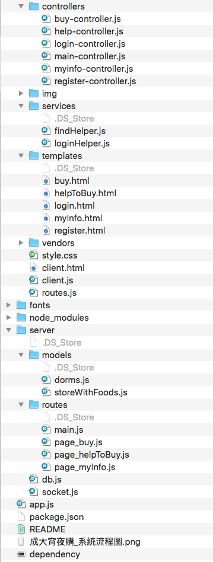
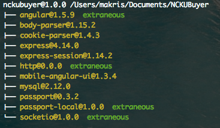

#成大宵夜購

### Introduction
This **成大宵夜購** is designed for those who live in dorms and want others to buy night food for them. 

### Structure
This app use MVC structure, the AngularJS has the controllers to handle interaction with user.

---

### File Structure
#### Client Side
* controller: handle interaction with user, get and post method, for example, login and register
* service: store the user info and do some certain thing. findHelper is for find those who are online; loginHelper will store the user info after they login
* templates: the html content
* client.html: main page
* client.js: inject the angular route

#### Service Side
* models: storeWithFoods.js will send the store name and its food information
* routes: for example, when user request for data from `/buy` the `page_buy` will response to it
* db: mysql database, store the user info, like name, email
* socket: keep the status of buyers and helpers when they are online. For example, when a user login, he will become a buyer (by default). After user leave, the socket will delete the user.
* app.js: initialization for express and passport

---
### Package Used

#### AngularJS
 to handle user interaction.
#### Body Parser
parse the request from client
#### cookie-parser
parse the cookie(for passport)
#### express
the server client
#### socket.io
communication for catch the buyer and helper info.
#### Passport
authorization when user login. After login, store the session cookie in client side.
#### mysql
store the user email, name, telephone and so on.
#### socket.io 
transfer the information when a order is confirmed

---
### Usage
install all dependency

`npm install`

run the server on port 3000

`node app.js`

